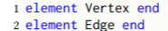
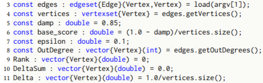
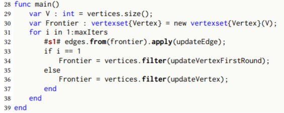

Getting Started
===============
 
## Downloading software
Make sure you have all the correct Open Source Software installed. Things you need can be found in the [README](https://github.com/yunmingzhang17/graphit) file at the GitHub Website. You will need either CILK or OPENMP to allow you to run the C++ code in parallel. If you dont have either you can get both by simply downloading [GCC](https://gcc.gnu.org/). Alternatively if you already have CILK or OPENMP you can use those too. This tutorial will go through how to use GraphIt via both CILK and OPENMP.
        
## Cloning graphit
Clone graphit by going to [GraphIt](https://github.com/yunmingzhang17/graphit)
        <p class="caption"> *Something to note for the following tutorial.*</p>
        <p class="caption"> *Everything will be done graphit/build/bin* </p>
   
## Basic Variables, Constructs, and Functions
If you have not yet already please read the basic information on the [GraphIt Language.](language)

### PageRankDelta Example

<p class="caption">*This is the code of Page Rank Delta using Graphit*</p>

Here we will go through an example of GraphIt Code using Page Rank Delta as an example. You can find this file under your graphit/apps folder 
Additionally here is a link to the [GraphIt paper.](https://arxiv.org/pdf/1805.00923.pdf) Sections 4 and 5 give the complete breakdown of the Page Rank Delta code. Please look here if you want a more detailed breakdown of the functionality of Graphit.

###      Algorithm Explanatation

<p class="caption">*Page Rank Delta Code lines 1-2* </p>

Here we construct the basic Elements that will be used by graphit. Most Graph Analysis Algorithms will require that you have both of these. GraphIt supports multiple types of user-defined vertices and edges, which is important for algorithms that work on multiple graphs.


<p class="caption">*Page Rank Delta Code lines 3-11* </p>

[A quick refresher on Variables](#variables)

After defining element types, the programmer can construct vertexsets and edgesets. Lines 3–4 of Fig. 4 show the definitions of an edgeset, edges, and vertexset, vertices. Each element of the edgeset is of Edge type (specified between “{ }”), and the source and destination of the edge is of Vertex type (specified between “( )”). The edgeset declaration supports edges with different types of source and destination vertices (e.g., in a bipartite graph). vertices uses the getVertices method on the edgeset to obtain the union of source and destination vertices of edges. Data for vertices and edges are defined as vectors associated with an element type denoted using the { } syntax (Lines 8–11).


<p class="caption">*Page Rank Delta Code lines 12-27* </p>

[A quick refresher on Functions](#functions)

The algorithm described here uses 3 main functions. The first is updateEdge which takes in an edge and adds to the current DeltaSum of the destination, the Delta of the source divided by the amount of out degrees of the source. 

The second function is updateVertexFirstRound that takes in a vertex and returning a boolean. It does this by multiplying the deltasum generated by the function above with the damping factor and adding the basescore. From this it computes the rank and using the delta it computes whether or not it exceeds a certain threshold. If this threshold is exceeded than it returns a boolean True and if not a boolean False. Then it sets the DeltaSum back to 0.

The third and last function does something similar to above by taking in a vertex and returning a boolean. However in this case it does not add the base score to the deltaSum times damping factor when determining Delta. Similarly then by comparing if the delta exceeded the threshold of epilson times the rank it outputs a True or False. 



<p class="caption">*Page Rank Delta Code lines 28-39* </p>

This is where your program comes together and runs together with all the functions you created. What makes GraphIt great is that the language constructs of GraphIt separates edge processing logic from edge traversal, edge filtering (from, to, srcFilter, and dstFilter), atomic synchronization, and modified vertex deduplication and tracking logic (apply and applyModified). This separation enables the compiler to represent the algorithm from a high level, exposing opportunities for edge traversal and vertex data layout optimizations. Moreover, it frees the programmer from specifying low-level implementation details, such as synchronization and deduplication logic. 

The algorithm maintains the set of vertices whose rank has changed greatly from previous iterations. This list of vertices is generated by the vertices.filter in lines 33 to 36. These vertices are known as the Frontier. We start with having all vertices in the frontier(line 29-30). On each iteration we update all the deltasums using the updateEdge function. As you can see in line 32 for all the edges that exist in the frontier we apply updateEdge. Then we generate a new set of vertices that are in the frontier. What Graphit allows us to do is create seperate functions for each part of the algorithm. In this case we have 2 general functions. One that updates the DeltaSum on each vertex and 2 that both determine if a Vertex should be in the Frontier. Then with graphit we can go in and optimize these specific parts functions without actually changing the code. All we need to do is change things in the scheduler. In this example we can modify #s1# and make the program run in parallel. 


###      Scheduling Explanatation

<p class="caption">*Page Rank Delta Code Schedule* </p>

We use labels (#label#) in algorithm specifications to identify the statements on which optimizations apply. Programmers can assign a label on the left side of a statement and later reference it in the scheduling language. Above shows a simple schedule for the PageRankDelta implementation. The programmer adds label s1 to the edgeset operation statement. After the schedule keyword, the programmer can make a series of calls with the scheduling functions.

 
## Compiling
Before we can compile Graphit you need to first follow these steps and build the bin for the program
          <h3>Build Graphit</h3>
            <p>To perform an out-of-tree build of Graphit do:</p>
            <p>After you have cloned the directory:</p>
            <pre><code>    
                cd graphit
                mkdir build
                cd build
                cmake ..
                make
            </code></pre>
            <p>To run the C++ test suite do (all tests should pass):</p>
            <pre><code>    
                cd build/bin
                ./graphit_test
            </code></pre>
            <p>To run the Python end-to-end test suite:</p>
            <p>start at the top level graphit directory cloned from Github, NOT the build directory
            (All tests would pass, but some would generate error messages from the g++ compiler. This is expected.)
            Currently the project supports Python 2.x and not Python 3.x (the print syntax is different)</p>
            <pre><code>    
                cd graphit/test/python
                python test.py
                python test_with_schedules.py
            </code></pre>
### Compile GraphIt Programs
<p class="caption">**For now all builds and compilations must be done in the graphit/build/bin directory due to linking and paths in the code. This will soon be updated so that users can compile anywhere but for now please do it in the bin.**</p>

GraphIt compiler currently generates a C++ output file from the .gt input GraphIt programs. 
To compile an input GraphIt file with schedules in the same file (assuming the build directory is in the root project directory) do the following. The -f denotes the input file and the -o denotes the output file. 
```
    cd build/bin
    python graphitc.py -f (input file path) -o (output file name)
    
```

The following is an example:
```
    cd build/bin
    python graphitc.py -f ../../test/input/simple_vector_sum.gt -o test.cpp
    
```
To compile an input algorithm file and another separate schedule file (some of the test files have hardcoded paths to test inputs, be sure to modify that or change the directory you run the compiled files) do the following. -a in this case denotes a seperate algorithm.


```
    cd build/bin
    python graphitc.py -a (algorithm file path) -f (schedule file path) -o (output file name)
```

The example below compiles the algorithm file (../../test/input/cc.gt), with a separate schedule file (../../test/input_with_schedules/cc_pull_parallel.gt)

```
    cd build/bin
    python graphitc.py -a ../../test/input/cc.gt -f ../../test/input_with_schedules/cc_pull_parallel.gt -o test.cpp
```

All new files will be located inside the bin directory. You must make the files here but they can be run elsewhere. After you compile your C++ program you can insert it into your own program. 


	parallel_for ( NodeID d=0; d < g.num_nodes(); d++) {
    	for(NodeID s : g.in_neigh(d)){
      		apply_func ( s , d );
    	} //end of loop on in neighbors
	} //end of outer for loop

This is an example of code that was generated through Graphit. You can see this by opening the files you have just generated.  In the schedule the user used edgeset_apply_pull_parallel creating a parallel_for loop. This allows you to run the the C++ code using multiple cpus reducing runtime. However for the program to actually run in parallel you must use CILK and OPENMP as described below.
### Compiling and Using GraphIt

To compile a serial version, you can use reguar g++ with support of c++11 standard to compile the generated C++ file (assuming it is named test.cpp).
 
```
    # assuming you are still in the bin directory under build/bin. If not, just do cd build/bin from the root of the directory
    g++ -std=c++11 -I ../../src/runtime_lib/ test.cpp  -o -O3 test.o
    ./test.o
```

To compile a parallel version of the c++ program, you will need both CILK and OPENMP. OPENMP is required for programs using NUMA optimized schedule (configApplyNUMA enabled) and static parallel optimizations (static-vertex-parallel option in configApplyParallelization). All other programs can be compiled with CILK. For analyzing large graphs (e.g., twitter, friendster, webgraph) on NUMA machines, numacl -i all improves the parallel performance. For smaller graphs, such as LiveJournal and Road graphs, not using numactl can be faster. 

```
    # assuming you are still in the bin directory under build/bin. If not, just do cd build/bin from the root of the directory

    # compile and run with CILK
    icpc -std=c++11 -I ../../src/runtime_lib/ -DCILK test.cpp -O3 -o  test.o
    numactl -i all ./test.o
    
    # compile and run with OPENMP
    icpc -std=c++11 -I ../../src/runtime_lib/ -DOPENMP -qopenmp test.cpp -O3 -o test.o
    numactl -i all ./test.o
    
    # to run with NUMA optimizations
    OMP_PLACES=sockets ./test.o 
    
```


## Tuning

We designed GraphIt’s scheduling language functions to allow programmers to compose together edge traversal direction, frontier data structure, parallelization, cache optimizations, and NUMA optimizations discussed in the paper. The configApplyDirection functions allow programmers to configure directions used for traversal. The programmer can use the configDenseVertexSet function to switch between bitvector and boolean array for either source or destination vertexset or both. The flexible configApplyNumSSG function configures the number of segmented subgraphs and how the subgraphs are partitioned (fixedvertex-count and edge-aware-vertex-count). Setting the right number of segments and partitioning configuration allows random accesses to be restricted to a NUMA node or last level cache with balanced load as described in the paper. configApplyNUMA configures the segmented subgraphs to be executed in parallel with static or dynamic NUMA node assignment (static-parallel and dynamic-parallel), ensuring the random memory accesses to be restricted to the local NUMA node, while maintaining good parallel scalability. Finally, vertex data vectors can be fused together into an array of structs with fuseFields. 
To compose together different optimizations, the programmer first chooses a direction for traversal. Then the programmer can use the other scheduling functions to pick one option for the parallelization, graph partitioning, NUMA, and dense vertexset optimizations for the current direction. The programmer can configure each direction separately using the optional direction argument for hybrid directions (DensePush-SparsePush or DensePull-SparsePush). If no direction argument is specified, then the configuration applies to both directions.

Here is a list of Scheduling functions that you can use


Below we will show how changing the Schedule affects the C++ generated Code. This first section of code is pageRankDelta code without a schedule.


