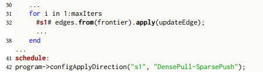
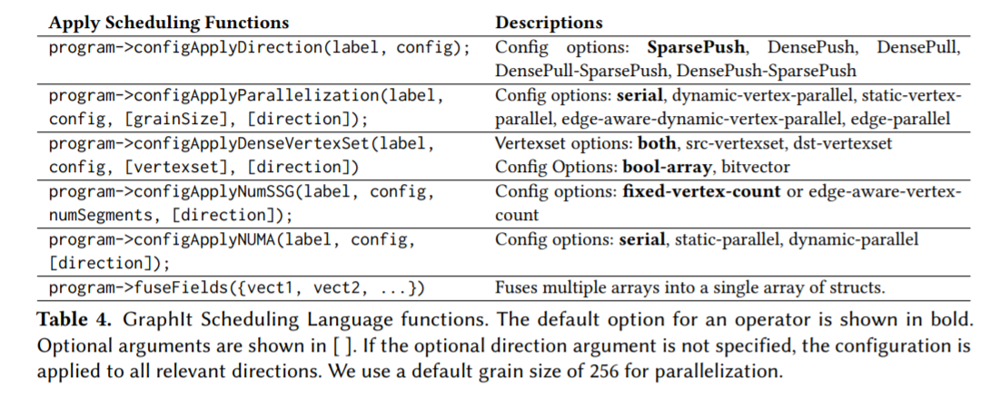
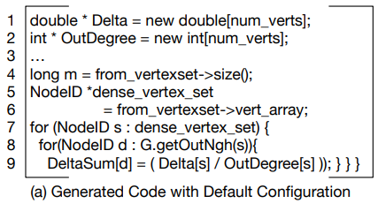
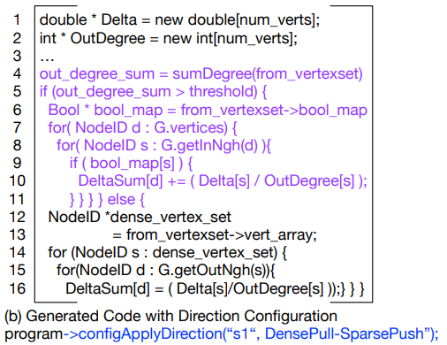
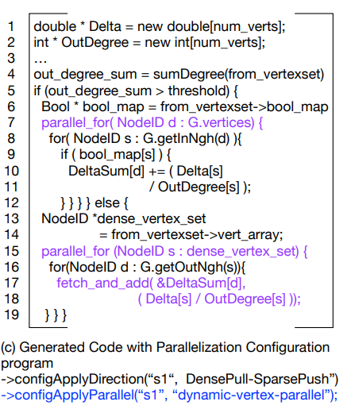
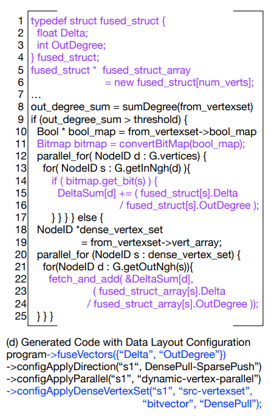

Getting Started
===============

{:.no_toc}

This guide introduces GraphIt language features with the PagerankDelta algorithm.


* auto-gen TOC:
{:toc}
 
## Downloading software
Make sure you have all the correct Open Source Software installed. First follow the [README](https://github.com/yunmingzhang17/graphit) file here to clone and install graphIt. You will need either CILK or OPENMP to allow you to run the C++ code in parallel. If you dont have either you can get both by simply downloading [GCC](https://gcc.gnu.org/). Alternatively if you already have CILK or OPENMP you can use those too. This tutorial will go through how to use GraphIt via both CILK and OPENMP.
        
## Cloning graphit
Clone graphit by going to [GraphIt](https://github.com/yunmingzhang17/graphit)
        *Something to note for the following tutorial.*
        *Everything will be done graphit/build/bin*
   
## Basic Variables, Constructs, and Functions

If you have not yet already please read the basic information on the [GraphIt Language.](language)

### PageRankDelta Example

```
element Vertex end
element Edge end
const edges : edgeset{Edge}(Vertex,Vertex) = load(argv[1]);
const vertices : vertexset{Vertex} = edges.getVertices();
const cur_rank : vector{Vertex}(float) = 0;
const ngh_sum : vector{Vertex}(float) = 0.0;
const delta : vector{Vertex}(float) = 1.0/vertices.size();
const out_degree : vector {Vertex}(int) = edges.getOutDegrees();
const damp : float = 0.85;
const beta_score : float = (1.0-damp)/vertices.size();
const epsilon2 : float = 0.1;
const epsilon : float = 0.0000001;

func updateEdge(src : Vertex, dst : Vertex)
    ngh_sum[dst] += delta[src]/out_degree[src];
end

func updateVertexFirstRound(v : Vertex) -> output : bool
    delta[v] = damp*(ngh_sum[v]) + beta_score;
    cur_rank[v] += delta[v];
    delta[v] = delta[v]-1.0/vertices.size();
    output = (fabs(delta[v]) > epsilon2*cur_rank[v]);
    ngh_sum[v] = 0;
end

func updateVertex(v : Vertex) -> output : bool
   delta[v] = ngh_sum[v]*damp;
   cur_rank[v] += delta[v];
   ngh_sum[v] = 0;
   output = fabs(delta[v]) > epsilon2*cur_rank[v];
end

func main()
    var n : int = edges.getVertices();
    var frontier : vertexset{Vertex} = new vertexset{Vertex}(n);
    for i in 1:10
        #s1# edges.from(frontier).apply(updateEdge);
        var output : vertexset{Vertex};
        if i == 1
           output = vertices.filter(updateVertexFirstRound);
        else
           output = vertices.filter(updateVertex);
        end
        delete frontier;
        frontier = output;
    end
    delete frontier;
end
```

*Page Rank Delta in Graphit*

Here we will go through an example of GraphIt Code using Page Rank Delta as an example. You can find a variant of this PagerankDelta file, along with a few other appliations, under your graphit/apps folder [here](https://github.com/yunmingzhang17/graphit/tree/master/apps). 

Additionally here is a link to the [GraphIt OOPSLA18 paper](https://dl.acm.org/citation.cfm?id=3276491) or [the arxiv report here](https://arxiv.org/pdf/1805.00923.pdf).  Sections 4 and 5 give the complete breakdown of the Page Rank Delta code. Please look here if you want a more detailed breakdown of the functionality of Graphit.

###      Algorithm Explanatation
```
element Vertex end
element Edge end
```

_element definitions_

Here we construct the basic Elements, `Vertex` and `Edge` with the `element` keyword that will be used by graphit. Note these basic Elements do not have to be named ”Vertex" or "Edge". Most Graph Algorithms will require that you have both of these. GraphIt supports multiple types of user-defined vertices and edges, which is important for algorithms that work on multiple graphs.

[A quick refresher on Variables](http://graphit-lang.org/language#variables)

```
const edges : edgeset{Edge}(Vertex,Vertex) = load(argv[1]);
const vertices : vertexset{Vertex} = edges.getVertices();
```

*vertexset and edgeset definitions*

After defining element types, the programmer can construct vertexsets and edgesets. Lines 3–4 of Fig. 4 show the definitions of an edgeset, `edges`, and vertexset, `vertices`. Each element of the edgeset is of `Edge` type (specified between “{ }”), and the source and destination of the edge is of `Vertex` type (specified between “( )”). The edgeset declaration supports edges with different types of source and destination vertices (e.g., in a bipartite graph). vertices uses the `getVertices()` method on the edgeset, `edges`, to obtain the union of source and destination vertices of edges. The `const` keyword simply says this vertexset, edgeset, or vector is globally accessible. 

```
const cur_rank : vector{Vertex}(float) = 0;
const ngh_sum : vector{Vertex}(float) = 0.0;
const delta : vector{Vertex}(float) = 1.0/vertices.size();
const out_degree : vector {Vertex}(int) = edges.getOutDegrees();
```
*vector definitions*

Data for vertices and edges are defined as vectors associated with an element type denoted using the { } syntax. For example, `cur_rank` is associated with `Vertex`, and is of type `float` (specified in the ( ) parenthesis). This is similar to fields of a struct in C or C++, but is stored as a separate vector. 

When using `export` functions, the edgesets, vertexsets, vectors would need to be explicitly allocated by the user, as documented [here](language#export-functions). 

```
const damp : float = 0.85;
const beta_score : float = (1.0-damp)/vertices.size();
const epsilon2 : float = 0.1;
const epsilon : float = 0.0000001;
```
*scalar definitions*

Lastly, initialize all the scalar values needed for the program. 

Next we move on to take a look at the functions used in the program. 

[A quick refresher on Functions](language#functions)

The algorithm uses three user-defined functions, `updateEdge`, `updateVertexFirstRound`, and `updateVertex`. 

```
func updateEdge(src : Vertex, dst : Vertex)
    ngh_sum[dst] += delta[src]/out_degree[src];
end
```

`updateEdge` takes in `src` and `dst` of an edge as arguments. The function adds to the current __ngh_sum__ of the destination vertex `dst`, the `delta` divided by the `out_degree` of the source vertex `src`. This function is later used in the main function and applied to every edge in the edgeset. 


```
func updateVertexFirstRound(v : Vertex) -> output : bool
    delta[v] = damp*(ngh_sum[v]) + beta_score;
    cur_rank[v] += delta[v];
    delta[v] = delta[v]-1.0/vertices.size();
    output = (fabs(delta[v]) > epsilon2*cur_rank[v]);
    ngh_sum[v] = 0;
end
```

`updateVertexFirstRound` takes in a vertex, `v`, and returns a boolean. It does this by multiplying the `ngh_sum` with the damping factor and adding the basescore. From this it computes the rank and using the delta it computes whether or not it exceeds a certain threshold. If this threshold is exceeded than it returns a boolean True and if not a boolean False. Then it sets the `ngh_sum` back to 0.

```
func updateVertex(v : Vertex) -> output : bool
   delta[v] = ngh_sum[v]*damp;
   cur_rank[v] += delta[v];
   ngh_sum[v] = 0;
   output = fabs(delta[v]) > epsilon2*cur_rank[v];
end
```

`updateVertex` also takes in a vertex and returning a boolean. However in this case it does not add the base score to `delta` when determining Delta. Similarly then by comparing if the delta exceeded the threshold of epilson times the rank it outputs a True or False. 

`updateVertexFirstRound` and `updateVertex` will be used later on to filter out the "active vertices". These are the vertices that will used in the next iteration of the algorithm. These active vertices are also known as the frontier. The reason for two functions is that the first time we update the vertexs some additional computation needs to be done as described above that isnt needed later on. Therefore the second function is run only once in the beginning of the algorithm.


```
func main()
    var n : int = edges.getVertices();
    var frontier : vertexset{Vertex} = new vertexset{Vertex}(n);
    for i in 1:10
        #s1# edges.from(frontier).apply(updateEdge);
        var output : vertexset{Vertex};
        if i == 1
           output = vertices.filter(updateVertexFirstRound);
        else
           output = vertices.filter(updateVertex);
        end
        delete frontier;
        frontier = output;
    end
    delete frontier;
end
```
*main function of PageRankDelta*

The `main` function is where your program comes together and runs together with all the user-defined functions. Similar to C and C++, you have to explicitly name the function `main`. 

GraphIt is designed to separate edge processing logic from edge traversal, edge filtering (from, to, srcFilter, and dstFilter), atomic synchronization, and modified vertex deduplication and tracking logic (apply and applyModified). This separation enables the compiler to represent the algorithm from a high level, exposing opportunities for edge traversal and vertex data layout optimizations. Moreover, it frees the programmer from specifying low-level implementation details, such as synchronization and deduplication logic. 

The algorithm iterates for 10 iterations to update each vertex's `cur_rank` value. The `cur_rank` is assumed to converge after 10 iterations, and represents the importance of each vertex based on its topological structure. In each iteration, the algorithm maintains the set of vertices whose rank has changed greatly from previous iterations, which is known as the `frontier`. We start with having all vertices in the frontier with frontier initalization ( `var frontier : vertexset{Vertex} = new vertexset{Vertex}(n);` ). The frontier generated by   
`output = vertices.filter(updateVertexFirstRound)`  
in the first iteration, which applies the `updateVertexFirstRound` function to all the `vertices`. In later iterations the frontier is generated by   
`output = vertices.filter(updateVertex)`.   
The user has to explicitly manage the memory and swapping of the frontier with `delete frontier; ` and `frontier = output;`

In each iteration we update the `delta` values using the `updateEdge` function in `#s1# edges.from(frontier).apply(updateEdge); `. We use the operator `from` to obtain the set of edges that comes out from the `frontier`. Then we use `apply `to apply the `updateEdge` function on these edges. The label `#s1` is used as a way to identify the edgeset operator for performance tuning using the scheduling. 


###  Scheduling Explanatation



*PagerankDelta Schedule*

We use labels (#label#) in algorithm specifications to identify the statements on which optimizations apply. Programmers can assign a label on the left side of a statement and later reference it in the scheduling language. Above shows a simple schedule for the PageRankDelta implementation. The programmer adds label `s1` to the edgeset operation statement. After the `schedule` keyword, the programmer can make a series of calls with the scheduling functions.

## Performance Tuning with the Scheduling Language

We designed GraphIt’s scheduling language functions to allow programmers to compose together edge traversal direction, frontier data structure, parallelization, cache optimizations, and NUMA optimizations discussed in the [paper](https://arxiv.org/pdf/1805.00923.pdf). To compose together different optimizations, the programmer first chooses a direction for traversal. Then the programmer can use the other scheduling functions to pick one option for the parallelization, graph partitioning, NUMA, and dense vertexset optimizations for the current direction. The programmer can configure each direction separately using the optional direction argument for hybrid directions (DensePush-SparsePush or DensePull-SparsePush). If no direction argument is specified, then the configuration applies to both directions.

We refer users to the [Scheduling Language](language#scheduling-language) section in the language manual for a more comprehensive introduction to performance tuning with the scheduling language. 

Here is a list of Scheduling functions that you can use



Below we will show how changing the Schedule affects the C++ generated Code for PageRankDelta. This first section of psuedo code is pageRankDelta code without a schedule.



*This is the generated code for Page Rank Delta with no scheduling. This means that there are no optimizations. All this C++ code does is the basic page rank deltasum addition*



*With this Schedule program->configApplyDirection("s1", DensePull-SparsePush) the program is affecting the #s1# label associated with the code*
'''
edges.from(frontier).apply(updateEdge)
'''
*If the amount of edges exceeds a certain threshold then the program runs from destination to source. If it is under than it runs from source to destination. Depending on the density of the graph one option may run faster than the other.*



*Here by adding to the schedule the generated C++ is capable of running in parallel on multiple cores at once. This is seen by the parallel_for loop in the code and if that loop is run using CILK or OPENMV then it being run on mulitple cores will make the program much faster.*



*Adding this to the schedule will fuse vertexs together allowing them to be handled in groups. By doing this you will improve spatial locatility and this will improve your cache hit rate. However on the other hand this is require more processing. Thus depending on your algorithm using a bitvector may or may not be useful.*


## Compiling

Before we can compile Graphit you need to first follow these steps and build the bin for the program

### Build Graphit

To perform an out-of-tree build of Graphit do:

After you have cloned the directory:
```
                cd graphit
                mkdir build
                cd build
                cmake ..
                make
```
To run the C++ test suite do (all tests should pass):
```
                cd build/bin
                ./graphit_test
```
To run the Python end-to-end test suite:

start at the top level graphit directory cloned from Github, NOT the build directory
(All tests would pass, but some would generate error messages from the g++ compiler. This is expected.)
Currently the project supports Python 2.x and not Python 3.x (the print syntax is different)
``` 
                cd graphit/test/python
                python test.py
                python test_with_schedules.py
```

### Compile GraphIt Programs

**For now all builds and compilations must be done in the graphit/build/bin directory due to linking and paths in the code. This will soon be updated so that users can compile anywhere but for now please do it in the bin.**

The graphit/build/bin is the location that cmake generates its binary files which are the actual executables for you to run your code. This is why to run any code you need to do it in the bin directory because that is where all the needed files are. 

GraphIt compiler currently generates a C++ output file from the .gt input GraphIt programs. 
To compile an input GraphIt file with schedules in the same file (assuming the build directory is in the root project directory) do the following. The -f denotes the input file and the -o denotes the output file. 

```
    cd build/bin
    python graphitc.py -f (input file path) -o (output file name)
    
```

The following is an example:

```
    cd build/bin
    python graphitc.py -f ../../test/input/simple_vector_sum.gt -o test.cpp
    
```

To compile an input algorithm file and another separate schedule file (some of the test files have hardcoded paths to test inputs, be sure to modify that or change the directory you run the compiled files) do the following. -a in this case denotes a seperate algorithm.


```
    cd build/bin
    python graphitc.py -a (algorithm file path) -f (schedule file path) -o (output file name)
```

The example below compiles the algorithm file (../../test/input/cc.gt), with a separate schedule file (../../test/input_with_schedules/cc_pull_parallel.gt)

```
    cd build/bin
    python graphitc.py -a ../../test/input/cc.gt -f ../../test/input_with_schedules/cc_pull_parallel.gt -o test.cpp
```

All new files will be located inside the bin directory. You must make the files here but they can be run elsewhere. After you compile your C++ program you can insert it into your own program. 


### Compiling and Using GraphIt

To compile a serial version, you can use reguar g++ with support of c++11 standard to compile the generated C++ file (assuming it is named test.cpp).
 
```
    # assuming you are still in the bin directory under build/bin. If not, just do cd build/bin from the root of the directory
    g++ -std=c++11 -I ../../src/runtime_lib/ test.cpp  -O3 -o test.o
    ./test.o
```

To compile a parallel version of the c++ program, you will need both CILK and OPENMP. OPENMP is required for programs using NUMA optimized schedule (configApplyNUMA enabled) and static parallel optimizations (static-vertex-parallel option in configApplyParallelization). All other programs can be compiled with CILK. For analyzing large graphs (e.g., twitter, friendster, webgraph) on NUMA machines, numacl -i all improves the parallel performance. For smaller graphs, such as LiveJournal and Road graphs, not using numactl can be faster. 

```
    # assuming you are still in the bin directory under build/bin. If not, just do cd build/bin from the root of the directory

    # compile and run with CILK
    icpc -std=c++11 -I ../../src/runtime_lib/ -DCILK test.cpp -O3 -o  test.o
    numactl -i all ./test.o
    
    # compile and run with OPENMP
    icpc -std=c++11 -I ../../src/runtime_lib/ -DOPENMP -qopenmp test.cpp -O3 -o test.o
    numactl -i all ./test.o
    
    # to run with NUMA optimizations
    OMP_PLACES=sockets ./test.o 
    
```

