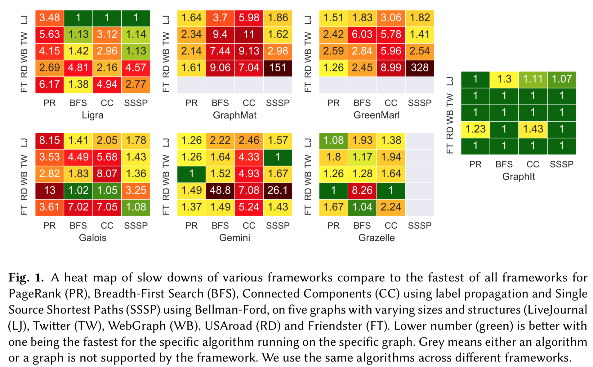

<meta name="Description" content="GraphIt - A High-
Performance Graph Domain Specific Language">

# About GraphIt

The performance bottlenecks of graph applications
depend not only on the
algorithm and the underlying hardware, but also on
the size and structure of the input graph.
As a result, programmers must try different combinations of a large
set of techniques, which
make tradeoffs among locality, work-efficiency, and parallelism, to develop the best implementation
for a specific algorithm and type of graph.
Existing graph frameworks and domain specific languages (DSLs) lack flexibility, supporting
only a limited set of optimizations.

GraphIt is a new DSL
for graph computations that generates fast implementations for algorithms
with different performance characteristics running on graphs
with different sizes and structures.
GraphIt separates what is computed
(algorithm) from how it is computed (schedule).
Programmers specify the algorithm using an algorithm
language, and performance optimizations are specified using a
separate scheduling language.
The scheduling language enables programmers
to easily search through this complicated
tradeoff space by composing together a large
set of edge traversal and vertex data layout optimizations.

GraphIt outperforms the next fastest of six state-of-the-art shared-memory
frameworks (Ligra, Green-Marl, GraphMat, Galois, Gemini, and Grazelle) by up to 4.8x and reduces the lines of code by up to an order of magnitude compared to the next fastest framework.Below we show some performance comparisons collected on our dual-socket system with Intel Xeon E5-2695 v3 CPUs with 12 cores each for a total of 24 cores and 48 hyper-threads. The system has 128GB of DDR3-1600 memory and 30 MB last level cache on each socket, and runs with Transparent Huge Pages (THP) enabled.

<iframe width="560" height="315" src="https://www.youtube.com/embed/ptIVf-YlkhY" frameborder="0" allow="accelerometer; autoplay; encrypted-media; gyroscope; picture-in-picture" allowfullscreen></iframe>

GraphIt is open source, under a [commercially permissive MIT
license](https://github.com/GraphIt-DSL/graphit/blob/master/LICENSE). We encourage
you to use it in open source or commercial projects! 

